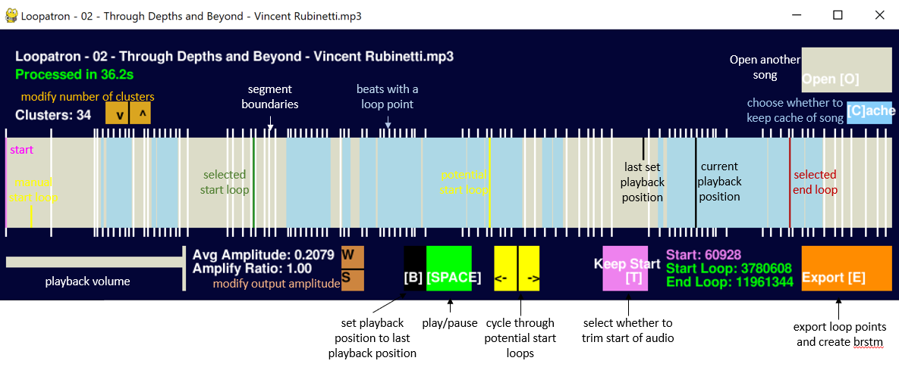

# Loopatron

This python program is designed to help find loops in songs. The program will output potential loops and through the user interface, the user can select the desired looping points by listening to the audio playback with the selected loops. Through the use of [LoopingAudioConverter](https://github.com/libertyernie/LoopingAudioConverter), the user can export the song as a brstm, a looping audio format used by games like Super Smash Bros. Brawl.

***
# Installation
Note: This application was tested on Python 3.7

pip install --upgrade pip  
pip install -r requirements.txt  

Then open Loopatron.json and set lacDir to the LoopingAudioConverter folder
***
# Usage

Loopatron.py 

When running this program, you will be greeted with a open file prompt, choose the song you'd like to loop. It will then begin to process the song. When finished, you should see the following screen:

The program segments the songs into beats. The beats highlighted in blue are beats that are potential loop points. Setting the end loop position to these beats will automatically show potential start loop positions. The current start loop position is highlighted in green, whereas all other potential start loop positions are highlighted in yellow and can be cycled through. It is also possible to manually set a start loop position, holding shift will highlight beats that belong to the same cluster as the end loop position. 

**Controls**

_On the main song bar_

Left Click: Set playback position of song

Right Click: Set end loop point position

Shift + Right Click: Manually set start loop point position

Shift + Left Click (while Trim Start is toggled): Set trim point of song 

_Anywhere_

Left / Right: Cycle through potential start loop points

Up / Down: Modify number of clusters (then press Q to recalculate, only available if evecs are present)

A/D: Adjust volume of audio playback

W/S: Adjust amplitude of brstm output

T: Toggle trim start of song in output

C: Toggle whether to cache song (to skip processing if want to revisit song later)

E: Export loop points and create brstm

O: Open new song

**Cache now, select loop points later**

If you select multiple songs on the file open prompt, the program will cache the songs so that they can be opened later without any processing / less wait time.

There are two different types of caches, the general beats cache and the evecs cache. The evecs cache is only useful if you'd like to recompute potential loop points through selecting a different number of clusters, by default they are not saved since they take up more space.

**Config**

[Loopatron.json](Loopatron.json) has various config options such as setting the max sample rate of the output and setting directories.

***

# Acknowledgements
B. McFee and D. Ellis for the [Laplacian Segmentation](https://librosa.org/librosa_gallery/auto_examples/plot_segmentation.html#sphx-glr-auto-examples-plot-segmentation-py) method

drensin for [Remixatron](https://github.com/drensin/Remixatron)

libertyernie for [LoopingAudioConverter](https://github.com/libertyernie/LoopingAudioConverter) as well as contributors to its dependencies

JGiubardo for the [Looper](https://github.com/JGiubardo/Looper) integration with LoopingAudioConverter
